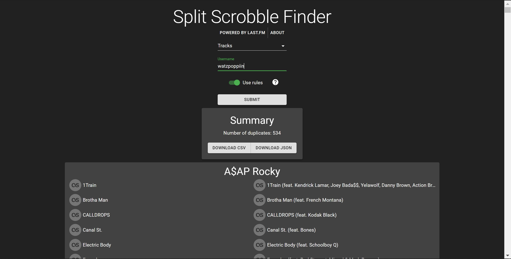

# Split Scrobble Finder
---

## Background

* This web app allows you to scan your Last.fm profile for split scrobbles. Split scrobbles can arise when streaming services change the metadata of a track, album or artist, such as adding a feature tag to the track title. Switching between music streaming platforms can also create split entries in your Last.fm profile, given that metadata is generally not standardized among all platforms.
* The client is built with ReactJS and depends on an Express server. The server is responsible for making calls to the Last.fm API and propagating the results back to the client, which executes the algorithm and displays its results.

## Usage

* The app is live at https://split-scrobble-finder.herokuapp.com/.
* Simply input your username and select either tracks, albums, or artists to scan your profile for split scrobbles.
  * There is an option to "use rules". Selecting this option will use a custom rule set I developed to help eliminate false split scrobbles. For example, "Human After All" and "Human After All - SebastiAn Remix" would not be detected as split scrobbles if the rule set is enabled. Otherwise, standard string similarity would be used, which would result in those two tracks being detected as a duplicate.
  * I recommend trying requests in both fashions. If you find that the rule set fails to detect true split scrobbles or falsely identifies split scrobbles, feel free to raise an issue here on GitHub or message me with the issue. The rule set algorithm can always be improved! 
* Note that request times can be significant, as it requires numerous strenuous calls to the Last.fm API. 
* Once your results have been fetched, you can scroll through the detected split entries, where each entry provides a hyperlink to the specified track/album/artist in your library on the Last.fm site. You can then edit the scrobbles as desired on Last.fm.
* You can also download your results in either JSON or CSV format, so you don't have to keep waiting for your results to be generated if you want to view your results again.

## Local Installation

### Prerequisites

* Node
* npm

### Instructions

* To use this app locally, you must have your own Last.fm API credentials. See [here](https://www.last.fm/api/account/create) for more details.
  * Once you have an API key and a shared secret, update `credentials.json` with these values.
* You must first build and launch the server. In the root directory, do the following:
  * Run `npm install` to install all server-side dependencies.
  * Run `npm start` to launch the server, which runs on port 3001 by default.
* You can then build and launch the client. In the `client` directory, do the following:
  * Run `npm install` to install all client-side dependencies.
  * Run `rpm start` to launch the React client, which runs on port 3000 by default. The `package.json` file included in the `client` directory proxies requests to the server running on port 3001.

### Algorithm Tests

* There is a set of tests found in the `tests` directory that ensure the algorithm works for various tag differences I have found in my own library.
* Simply run `npm run test` to run all of these tests.
* The GitHub workflow is set up to rerun these tests each time a commit is pushed to master.